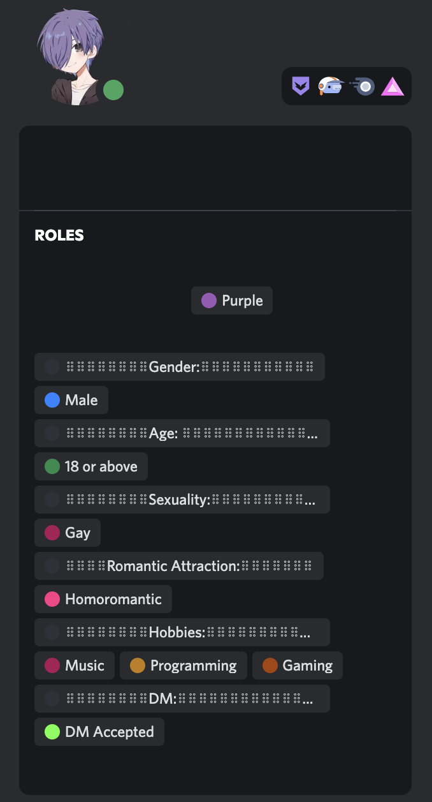

# This is my Discord bot to manage selfroles

Special thanks to Inari, she introduced me to JavaScript and helped me a bit.

Here are examples what the Messages with Buttons looks like and what the Profile will look like.




## Documentation i used

- [Eris](https://abal.moe/Eris/)
- [Slash Create](https://www.npmjs.com/package/slash-create)
- [Discord Message Components](https://discord.com/developers/docs/interactions/message-components)
- [Discord Embed Object](https://discord.com/developers/docs/resources/channel#embed-object)


## NoteJS Stuff i used

```
npm install eris
npm i slash-create
```

## Config File

This file is hidden in this Repository, because I don't want to share my API Token.

You have to create an `config.js` file, here is an empty config files content:
```JS
module.exports = {
    Token: '',          //Your API Token
    ApplicationID: '',  //The ApplicationID
    PublicKey: '',      //The Public Key
    initRole: ''        //ID of the Role that can use this Bot
}
```


## Roles

All the contents and setting of the embeds and the buttons are in `role.js`, the file is in this repository and can be used as an example.

### Role Group

Every group is an object array.
Element 0 always contains the settings for the group, what the buttons and the Embed looks like.
The rest contains the role names, IDs and other stuff. 

#### Group Settings

This Example here is from the `roles.js` that is in this Repository.

- `title`: the title of the embed message for this group
- `description`: the group description in the embed
- `color`: the color of the embed message
- `ShowRoles`: either true or false, when true it will list all the roles from this Group in the embed
- `ShowEmotes`: buttons can have emotes, simply enable or disable them
- `FieldName`: contains the name of the field used for the role listing
- `AllowMultiple`: either true or false, when true users can have as many roles of the group at once as they desire, if false only one and cosing another role of this group will remove the old one  

#### Objects in Role group

- `name: ""`: contains the name that the Button will have and always has to be set
- `RoleID`: contains the ID of the role, this also has to be always used.
- `EmoteName: ""`: contains the name of the Emote, in case of a normal Emote the name is just the Emote, if it is a custom emote is has to contain the Emote name
- `EmoteID: ""`: only has to be used if `CustomEmote` is set to `true`, contains the ID of the custom emote
- `CustomEmote: true/false`: Has to be used when using any emotes, set to `true` if you want to use Discord custom emotes, or to `false` when just default emotes are used.